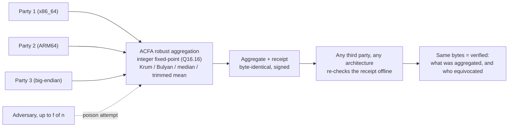
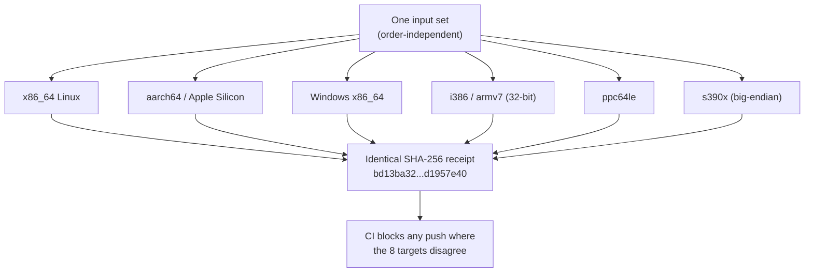

# ACFA

Deterministic Byzantine-robust aggregation for federated learning and distributed systems,
with verifiable receipts.

[](https://github.com/mgillr/acfa-rs/actions/workflows/ci.yml)
[](https://arxiv.org/abs/2607.10305)

Aggregate vectors from mutually distrusting parties. Get the same bytes on every machine,
and a receipt any third party can re-check offline.

```rust
use acfa_aggregate::{krum_aggregate, Contribution};

let agg = krum_aggregate(&contributions, 1)?;  // f = 1 tolerated adversaries
```

## How it works

Mutually distrusting parties -- each on whatever hardware they run -- submit signed updates.
ACFA combines them with a robust rule so an adversarial minority cannot move the result,
computes the aggregate as an exact function of the input *set*, and emits a receipt. Anyone,
on any architecture, can re-run that receipt offline and get the identical bytes -- so the
answer to "who moved the aggregate" is checkable rather than asserted.



## What it solves

Robust aggregation rules (multi-Krum, Bulyan, coordinate median, trimmed mean) already exist
in most federated learning frameworks. They bound how far a minority of adversaries can
move your result.
They do not tell you **who** moved it.

That gap is arithmetic, not cryptography. Float aggregation is order-dependent: sum the same
updates in a different order and you get different bytes. So when two servers report
different aggregates, you cannot distinguish a faulty server from a lying participant. The
honest case is already ambiguous, so no accountability layer can sit on top of it.

ACFA computes the aggregate in integer fixed point (Q16.16), making it an exact function of the input
*set*. After that, any disagreement is a difference in inputs or in conduct.

Identical glibc 2.41, x86_64 vs aarch64, 600,000 samples:

| | divergences |
|---|---|
| raw libm (`exp`, `cos`, `ln`) | 293 (~1 in 2,047), each exactly 1 ULP |
| same values through the Q16.16 boundary | 0 |

Numbers and method in [`build/DETERMINISM-RESULTS.md`](build/DETERMINISM-RESULTS.md); the
smaller first probe that motivated it is in
[`research/xarch-libm-divergence.md`](research/xarch-libm-divergence.md).

CI blocks any push where **eight** architectures fail to produce a byte-identical receipt:
x86_64 Linux, aarch64 Linux, Apple Silicon and x86_64 Windows on real hardware, plus i386
and armv7 (32-bit), ppc64le, and s390x (**big-endian**) under emulation.

The big-endian row is the one that matters. A machine that lays out integers the other way
round is where byte-identity breaks if it is going to. x86_64 little-endian and s390x
big-endian produce the same SHA-256 over the full five-scenario fingerprint,
`bd13ba3209a940b2025368a63c546ffd59e2580a1b8aa7128cc9b423d1957e40`. Method and reproduction in
[`build/ARCHITECTURE-COVERAGE.md`](build/ARCHITECTURE-COVERAGE.md).



## Install

Nothing is published to crates.io or PyPI. Everything installs from this repository.

Rust 1.87+ (`is_multiple_of`). Layer 1 has zero dependencies.

The CLI tools, no checkout needed:

```sh
cargo install --git https://github.com/mgillr/acfa-rs acfa-aggregate   # acfa-agg
cargo install --git https://github.com/mgillr/acfa-rs acfa-receipt     # acfa-verify
```

As a dependency. Cargo finds each crate by name inside the repository, so `git` alone is
correct here; adding `path` alongside it is a manifest error:

```toml
[dependencies]
acfa-aggregate = { git = "https://github.com/mgillr/acfa-rs" }
acfa-receipt   = { git = "https://github.com/mgillr/acfa-rs" }
acfa-finality  = { git = "https://github.com/mgillr/acfa-rs" }
```

Python:

```sh
pip install "git+https://github.com/mgillr/acfa-rs#subdirectory=adapters/flower"
```

That installs the adapter itself, and pulls numpy. Add `flwr` for the Flower strategy:
`pip install "acfa-flower[flower] @ git+https://github.com/mgillr/acfa-rs#subdirectory=adapters/flower"`.

The Python package shells out to `acfa-agg` so every language gets identical bytes, and
finds it on PATH after the `cargo install` above. Set `ACFA_AGG_BIN` to override. There is
no pure-Python fallback: a second implementation could silently disagree, which is the
failure the fixed-point kernel exists to remove.

## Quickstart

```sh
git clone https://github.com/mgillr/acfa-rs
cd acfa-rs/build/layer2-receipt

cargo run -q --release --example issue -- --pki > trusted.pki
cargo run -q --release --example issue           > receipt.acfa
cargo run -q --release --bin acfa-verify -- receipt.acfa --pki trusted.pki --f 1
```

```
VERIFIED
  round        1
  state root   f55014da78efb1a78c659d4b62056efac8a26b1eae674279510b383151fe5a43
  output root  d7ac08f2deb1a4ab2ecf185854ab23710cb712f0c4d48abbee1af0f107d17edd
  aggregate    3 values, first [7, 3, 4]
  admitted     [1, 2, 3, 4, 5]
  convicted    []
  bound n>=req met (5 admitted, 5 required) -- POPULATION only, not a safety verdict
```

`--pki` is required. A receipt carries its own identity set, so checking it against itself
proves nothing: mint five keys and every signature in the resulting receipt is valid.

```sh
cargo run -q --release --example issue -- --forged-pki > forged.acfa

cargo run -q --release --bin acfa-verify -- forged.acfa --pki trusted.pki --f 1  # exit 1
cargo run -q --release --bin acfa-verify -- forged.acfa                          # exit 3
```

Exit codes: `0` verified, `1` invalid, `2` unparseable, `3` self-consistent only.

## API

### Rust

```rust
use acfa_aggregate::{krum_aggregate, bulyan_aggregate, coord_median_trim, Contribution};

let cs = vec![
    Contribution { tie_key: b"node-1".to_vec(), v: vec![65536, 131072] },  // Q16.16
    Contribution { tie_key: b"node-2".to_vec(), v: vec![65600, 131000] },
];

let agg = krum_aggregate(&cs, 1)?;        // needs n >= 2f+3
let agg = bulyan_aggregate(&cs, 1)?;      // needs n >= 4f+3, refuses below
```

`tie_key` breaks exact score ties. It must be stable per contributor and is never
interpreted. Out-of-range and non-finite values are refused, not saturated.

Receipts:

```rust
use acfa_receipt::{Receipt, Policy, Rule, State};

let receipt = Receipt::issue(&state, round, &pki, f, Rule::Krum);
let bytes   = acfa_receipt::encode(&receipt);

// Verification needs a policy you obtained independently, not the receipt's own.
let verified = receipt.verify(&Policy::new(trusted_pki, f))?;
println!("{:?} admitted, {:?} convicted", verified.admitted, verified.convicted);
```

### Python (Flower)

```python
from acfa_flower import AcfaStrategy, Rule

strategy = AcfaStrategy(rule=Rule.KRUM, f=1, min_fit_clients=5)
```

Drop-in for `FedAvg` **as wiring**. Sampling, config and evaluation are inherited.
`num_examples` is ignored: FedAvg weights by it, it is an unverifiable self-report, and
weighting a robust rule by it hands back the guarantee.

**It is not a drop-in for FedAvg's BEHAVIOUR on non-IID data.** Every robust rule here
selects by distance from the other clients, and a client whose data comes from a different
distribution is far from the majority for the same reason an attacker is -- the rule cannot
tell them apart. Measured with **zero adversaries**, one client drawn from `N(3,1)` and the
rest from `N(0,1)`, `KRUM` retains 3% / -0% / 0% of that client's proportional share at 10 /
20 / 40 clients, against `MEAN`'s ~100% control; the effect does not wash out as the cohort
grows. That is inherent to distance-based robust aggregation rather than a defect here, but
it changes who the model learns from. Full table and the milder rules:
[adapters/flower/README.md](adapters/flower/README.md#non-iid-data-a-minority-client-is-excluded-with-zero-adversaries).

Direct call:

```python
from acfa_flower import aggregate, Rule

result = aggregate(client_updates, rule=Rule.KRUM, f=1, tie_keys=client_ids)
```

### Any language

```console
$ printf 'rule krum\nf 1\n01 3ff0000000000000\n02 3ff199999999999a\n03 3ff3333333333333\n04 3ff4cccccccccccd\n05 4024000000000000\n' | acfa-agg
ok 75366
```

Values cross as IEEE-754 bits, output is Q16.16. `rule` is one of `krum`, `bulyan`,
`median`, `trimmed`, `mean`.

## Distributed systems properties

Relevant if you are building on async gossip with no coordinator:

**Order invariance.** The aggregate is a function of the multiset, not the delivery
sequence. Replicas that received the same contributions in different orders, with
duplicates, compute identical bytes. No agreement protocol needed to get agreement on the
result.

**Content-addressed state.** Contributions and equivocation proofs are a grow-only product
CRDT -- an OR-Set crossed with a G-Set -- merging by union over Merkle-addressed leaves.
Merge is commutative, associative and idempotent, so the state converges without ordering.

**Attribution.** An identity that signs two different values for the same round produces a
self-authenticating proof. Any node holding the PKI verifies it offline, with no quorum and
no appeal to who reported it. Honest nodes derive the proof themselves on observing both
halves, so suppression does not work.

**Fail-visible finality** (`acfa-finality`). A round certificate is `f+1` signatures over
the admitted membership, equivocation cut and aggregate root, with membership pinned by
authenticated broadcast rather than a wall clock. If the synchrony bound breaks, or the round
budget is under-provisioned below `2 tau` while it holds, two disjoint honest groups can each
certify a different cut. At `n >= 3f+2` that requires no Byzantine participant, so nobody is
attributable and a naive design fails silently. Here the fork is the evidence: two valid
conflicting certificates cannot coexist under the assumption, so their coexistence proves it
broke. Nodes halt, publish the pair, reconcile from the last uniquely-certified round.

## Use cases

Every command below was run against this tree.

**Federated learning with an audit trail.** Sites train locally, share only updates, raw data
never moves. Later a regulator asks which contributions produced the deployed model; the
receipt answers from the artefact alone.

```sh
cd build/layer1-aggregate && cargo run -q --release --example uc1_poisoned_fl
```

```
hosp-E   [-45.0, 60.0, -30.0]   <-- compromised

FedAvg (plain mean)   [-8.278, +12.318, -5.916]
multi-Krum (ACFA)     [+0.905, +0.395, +0.105]
```

**Multi-party model merging.** Several organisations merge deltas and each must sign off on
one result. Each reproduces the same bytes independently.

```sh
cd build/layer2-receipt && cargo run -q --release --example uc2_merge_order
```

**Reproducible robustness research.** New aggregation rules are compared across papers whose
implementations quietly disagree. Here the Python reference and the Rust production code are
held to byte-identical agreement in CI, so a new rule ships with golden vectors and the claim
is machine-checked.

```sh
python3 build/layer2-receipt/tests/golden/generate_l2.py | diff - build/layer2-receipt/tests/golden/vectors_l2.json && echo identical
```

**Cross-language pipelines.** A Python researcher produces an aggregate a Rust deployment
reproduces exactly, because both are held to the same vectors.

**Fork diagnosis.** When a decentralised run ends in two conflicting states, `acfa-finality`
gives the round it happened in and the two signed certificates proving it, including the case
where no participant misbehaved and timing simply broke.

**Offline audit.** An auditor with no access to any participant re-derives the figure from
the receipt. No network, no clock, no live system.

Not implemented here: merging receipts across independently operated instances, and paying
for verified contributions on-chain. Both follow from the primitives; neither is in this
repository.

## Performance

GitHub runner, single-threaded, `cargo run --release --example scale`:

| participants | dimension | receipt | verify |
|---|---|---|---|
| 10 | 100 | 9.8 KiB | 1.5 ms |
| 100 | 100 | 90 KiB | 21 ms |
| 25 | 10,000 | 2.0 MiB | 111 ms |

Verify costs roughly what issue costs: it re-executes the rule instead of checking a claimed
answer. Multi-Krum is `O(n^2 d)`, so participant count dominates, not dimension.

## Limitations

- A valid receipt proves honest computation over the set it showed you. It does not prove the
  issuer showed you everything it held. Compare the state root against an independently
  obtained one for that.
- `n >= 2f+3` is a population bound, not a safety guarantee. At n=10, f=3, where it holds, a
  colluding adversary near the honest mean is selected in 30/30 trials and moves the aggregate
  1.74x past the honest floor while staying inside the honest spread. Bulyan does not help
  (1.56x vs Krum's 1.61x at n=15) and refuses below `n >= 4f+3`; `coord_median_trim` is worse
  at 2.21x. Property of the imported rules. The field is named `population_bound_met`
  accordingly. See `build/layer1-aggregate/tests/within_norm.rs`.
- Q16.16 fixes range at +/-2^15, resolution 2^-16. Out-of-range values are refused, not
  saturated, because saturation would make the result depend on which replica saturated first.
  Rescale upstream with a factor both parties hold.
- Sybil resistance is delegated to the PKI.
- Krum is Euclidean and admits coordinate-concentrated attacks inside the honest spread.
  Bulyan defends that shape specifically, at `n >= 4f+3`.
- No independent security review. Three bugs were found and fixed during development: a
  receipt that verified against its own carried identity set, an unbounded allocation from an
  attacker-controlled length prefix, and a default tie-break key derived from arrival order.
  See [SECURITY.md](SECURITY.md).

## Paper

[Byzantine Accountability Without Consensus](https://arxiv.org/abs/2607.10305)
(arXiv:2607.10305, July 2026). Copy in [`paper/acfa.pdf`](paper/acfa.pdf), citation metadata
in [CITATION.cff](CITATION.cff).

The reference implementation is vendored at [`reference/acfa.py`](reference/acfa.py) with its
hash pinned. CI regenerates both layers' golden vectors from it and requires byte-identity, so
the Rust is checked against a second, independently written implementation.

One divergence is deliberate. The reference's Bulyan stage-1 loop draws at most `n-f-2`
candidates while `theta = n-2f`; those differ exactly when `f < 2`, so at `f = 1` it selects
one fewer than its own theta. This implementation refuses below `n >= 4f+3` and otherwise
draws exactly theta. The suite asserts the divergence and asserts it is still present, so a corrected
reference fails CI. No result in the
paper is affected: its one Bulyan experiment runs at `n=16, f=3`, re-run unmodified to its
published numbers.

## Layout

```
build/layer1-aggregate   aggregation rules, fixed point, zero deps, acfa-agg binary
build/layer2-receipt     signatures, equivocation proofs, wire format, acfa-verify binary
build/layer2-finality    round certificates, deadline cut, halt-and-reconcile
adapters/flower          Flower strategy
reference/               the paper's reference implementation, hash-pinned
```

Layer 1 decides what a set of vectors aggregates to. Layer 2 decides who is in the set, and
passes contribution leaves to Layer 1 as an opaque tie-break key. The coupling runs one way,
so Layer 1 is usable alone.

## Contributing

[CONTRIBUTING.md](CONTRIBUTING.md). Claims carry the command that produced them and its
output.

## Licence

Apache-2.0. No patents filed or planned -- and the licence's section 3 patent grant
makes that binding on every contributor rather than a statement of intent.

`acfa-aggregate` has no dependencies. `acfa-receipt` and `acfa-finality` use Ed25519
via `ed25519-dalek`, `curve25519-dalek` and `subtle`, which are BSD-3-Clause: their
notices are reproduced in [`NOTICE`](NOTICE), which you must keep when redistributing
a built binary. Nothing in the transitive tree is copyleft.

---

## This repository

```
build/layer1-aggregate    the deterministic kernel, zero dependencies
build/layer2-receipt      contribution set, equivocation proofs, receipts, acfa-verify
build/layer2-finality     round certificates, deadline cut, halt-and-reconcile
adapters/flower           Flower strategy, shells out to acfa-agg for identical bytes
reference/acfa.py         the paper's kernel, vendored and hash-pinned
paper/acfa.pdf            arXiv:2607.10305
tools/                    checks that hold the documentation to the code
```

Everything here is checked on every push, and you can run the same checks:

```sh
cargo test --release                          # in any of the three build/ crates
python3 tools/readme-commands.py              # runs every command this file documents
python3 tools/coverage-claim-check.py         # holds the coverage table to the workflow
shasum -a 256 -c SHA256SUMS                   # in reference/, pins the vendored kernel
```

The first two exist because a reader runs the commands before they run anything else.
`tools/readme-commands.py` executes every command this file documents against a real git
remote: the dependency block as an actual manifest, both `cargo install` lines, the pip
install, and the quickstart's exit codes, plus a check that every path a documented command
touches is present. `tools/coverage-claim-check.py` does the same for the architecture
table, requiring each row it claims to appear in the workflow. Documentation that does not
work is a build failure here, not a bug report.

History starts at the first commit of this tree. Working notes and screening material are
not part of the release and are not carried over.
